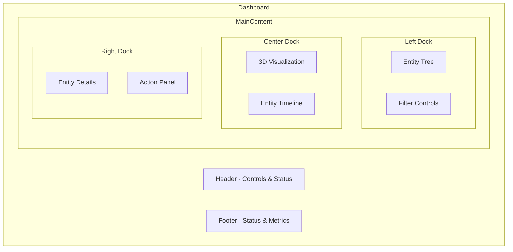
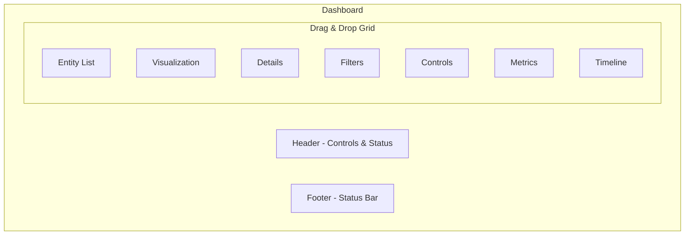
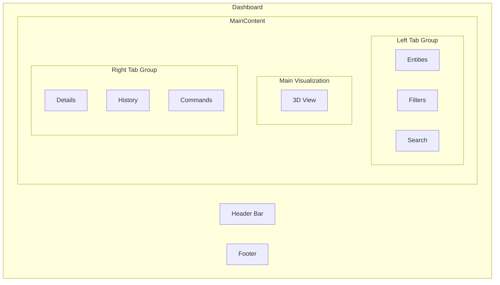
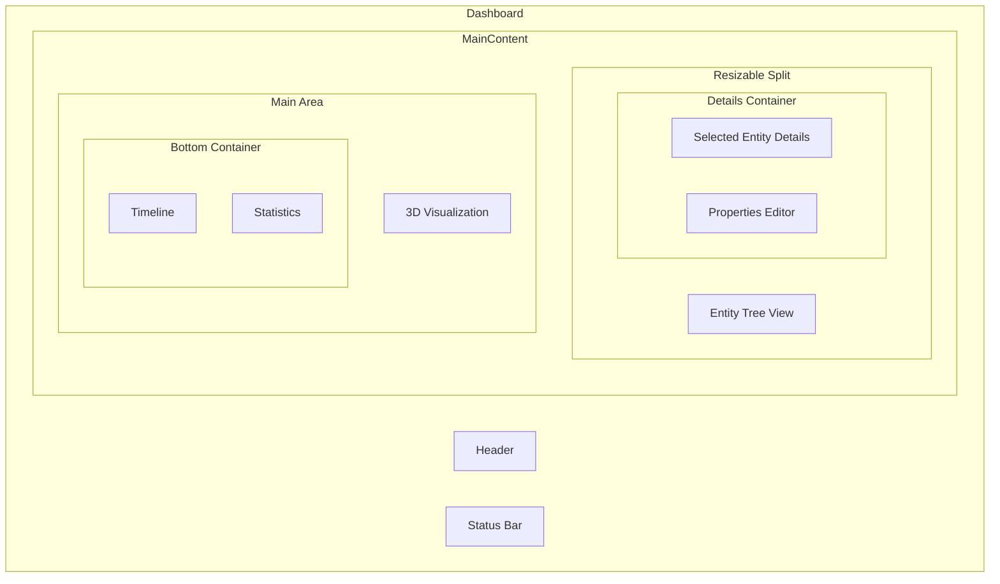
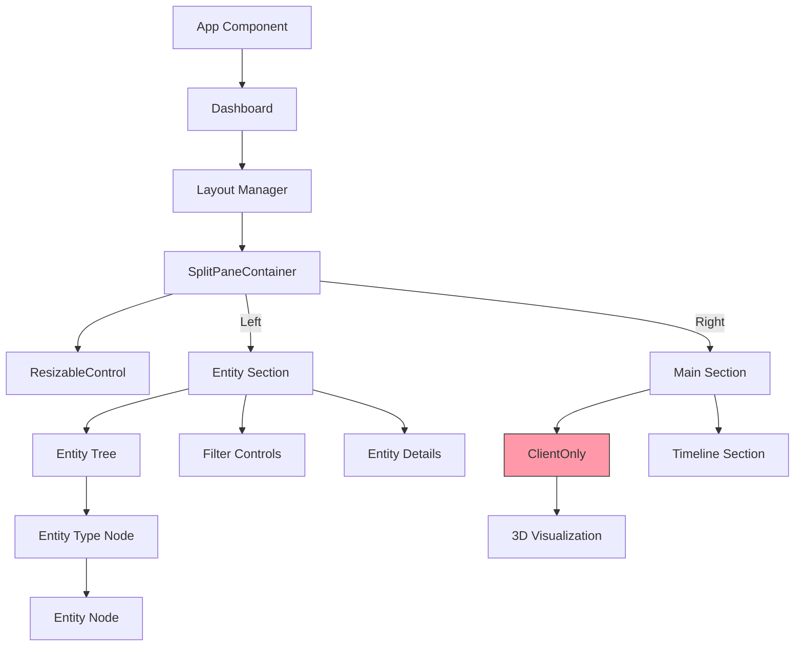

# UI Layout Design Creative Phase

## Requirements & Constraints

- Create a ClientOnly wrapper to solve hydration mismatches
- Ensure consistent state between server/client rendering
- Reorganize layout with adjacent entity/details panels
- Support collapsible/expandable panels
- Implement nested entity organization by type
- Add advanced filtering capabilities
- Create drag-and-drop UI customization
- Maintain performance with 100+ entities
- Must work on standard desktop browsers
- Must follow established design system

## Options Analysis

### Option 1: Dock-Based Layout with Fixed Regions



**Pros:**
- Clear designated areas for each function
- Predictable layout that users can learn quickly
- Simpler implementation with fixed containers
- Easier to maintain state consistency

**Cons:**
- Less flexible than fully customizable approach
- Limited layout customization options
- May not efficiently use screen space for all workflows
- Can feel constraining for advanced users

### Option 2: Fully Customizable Grid Layout



**Pros:**
- Maximum flexibility for user workflows
- Users can optimize layout for their specific needs
- Can save/load layout configurations
- Better space utilization for different screen sizes

**Cons:**
- More complex implementation
- State management becomes challenging
- Performance concerns with many draggable elements
- May confuse novice users without proper guidance

### Option 3: Tab Groups with Dockable Panels



**Pros:**
- Balances flexibility with structured organization
- Familiar UI pattern (similar to VS Code, browsers)
- Efficient use of screen space through tabbing
- Moderate implementation complexity

**Cons:**
- Tabs can hide important information
- Context switching between tabs may slow workflows
- Limited simultaneous viewing of different panels
- Requires clear tab indicators to avoid confusion

### Option 4: Split-Pane Layout with Resizable Containers (SELECTED)



**Pros:**
- Intuitive resizing of panel sizes
- Always visible panels with adjustable emphasis
- Maintains spatial relationships between components
- Simpler than full drag-and-drop while still flexible

**Cons:**
- Limited reorganization of panel positions
- Can become cluttered with many split panes
- Resize handles can be difficult for precise adjustment
- May not scale well to very complex interfaces

## Selected Approach: Split-Pane Layout

After evaluating all options, we've selected **Option 4: Split-Pane Layout with Resizable Containers** as it provides the best balance of flexibility, usability, and implementation complexity. This approach allows users to customize their workspace while maintaining a predictable structure.

## ClientOnly Wrapper Implementation Approach

```typescript
import { useEffect, useState, ReactNode } from 'react';

interface ClientOnlyProps {
  children: ReactNode;
  fallback?: ReactNode;
}

export function ClientOnly({ children, fallback = null }: ClientOnlyProps) {
  const [isMounted, setIsMounted] = useState(false);
  
  useEffect(() => {
    setIsMounted(true);
  }, []);
  
  if (!isMounted) {
    return <>{fallback}</>;
  }
  
  return <>{children}</>;
}
```

## State Consistency Solutions

1. **Hydration-safe initial state**:
   - Use deterministic initial state generators
   - Avoid time-based or random values in initial state
   - Defer dynamic content loading until after hydration

2. **State initialization pattern**:
   - Server: Generate and serialize initial state
   - Client: Rehydrate from serialized state
   - Use useEffect for client-only state modifications

3. **Layout state persistence**:
   - Store layout configuration in localStorage
   - Apply saved layout after hydration completes
   - Provide default layout for first-time visitors

## Implementation Guidelines

1. **ClientOnly Wrapper**:
   - Create reusable ClientOnly component
   - Apply to all Three.js and browser-specific components
   - Use lightweight skeleton placeholders during SSR

2. **Layout Structure**:
   - Implement a nested split-pane system
   - Use CSS Grid or a library like react-split-pane
   - Make all dividers resizable with minimum sizes
   - Allow panels to be collapsed/expanded

3. **Entity Organization**:
   - Create a collapsible tree view with entity types as parent nodes
   - Show entity status with color indicators
   - Include filtering controls above the tree
   - Support quick search functionality

4. **Panel Management**:
   - Make details panel directly adjacent to entity list
   - Add collapse/expand controls on panel headers
   - Implement minimized state for collapsed panels
   - Store panel states in user preferences

5. **Advanced Features**:
   - Add panel maximization option for focused work
   - Include layout reset option
   - Provide several preset layouts for different workflows
   - Allow limited panel reorganization through drag-and-drop

6. **State Management**:
   - Create a dedicated slice for UI layout state
   - Implement persistence through localStorage
   - Handle layout state separately from entity data
   - Use React context for layout control components

## Component Structure



## Verification

This solution meets all requirements by providing:
- Flexible but structured layout system
- Adjacent entity list and details panels
- Collapsible/expandable panels
- Advanced entity organization and filtering
- Consistent state between server and client
- ClientOnly wrapper for Three.js components
- Performance-conscious implementation approach 