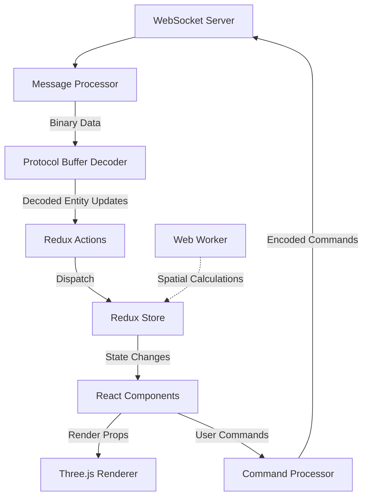

# System Patterns: Real-time Multi-Entity Dashboard

## System Architecture
The dashboard application follows a modern architecture optimized for high-performance real-time visualization:

```
dashboard/
├── app/              # Next.js App Router files
├── components/       # React components organized by feature
│   ├── visualization/  # 3D visualization components
│   ├── controls/       # UI controls and panels
│   ├── entities/       # Entity-related components
│   └── shared/         # Shared UI components
├── lib/              # Core utilities and logic
│   ├── state/          # Redux state management
│   ├── websocket/      # WebSocket communication
│   ├── three/          # Three.js utilities and helpers
│   └── workers/        # Web Worker implementations
└── public/           # Static assets
```

## Key Technical Decisions

### Visualization Architecture
- **Three.js / WebGL**: Core 3D rendering engine
- **React Three Fiber**: React bindings for Three.js
- **WebGL Instancing**: Efficient rendering of similar entities
- **Level of Detail (LOD)**: Dynamic detail based on camera distance
- **Optimized Camera Controls**: Custom controls for smooth navigation

### State Management
- **Redux Toolkit**: Centralized state with normalized entity store
- **Optimized Selectors**: Memoized selectors for efficient state access
- **Immutable State Patterns**: Efficient updates without full re-renders
- **Spatial Indexing**: Optimized data structures for spatial queries

### Real-time Communication
- **WebSockets**: Bidirectional communication for entity updates
- **Protocol Buffers**: Efficient binary serialization format
- **Reconnection Handling**: Automatic reconnection with state recovery
- **Latency Optimization**: Minimizing network overhead for critical updates

### Performance Optimization
- **Web Workers**: Offloading heavy computation from main thread
- **Render Optimization**: Minimizing unnecessary re-renders
- **Memory Management**: Efficient resource allocation and cleanup
- **GPU Acceleration**: Leveraging hardware acceleration for rendering
- **Request Animation Frame**: Synchronized rendering with browser

## Data Flow Architecture



## Component Architecture

### UI Component Hierarchy
```
DashboardLayout
├── ThreeJSVisualization (Main view)
│   ├── CameraControls
│   ├── EntityInstances
│   ├── TerrainRenderer
│   └── EffectsManager
├── EntityPanel (Left sidebar)
│   ├── EntityList
│   ├── FilterControls
│   └── GroupManager
├── DetailsPanel (Right sidebar)
│   ├── EntityDetails
│   ├── StatusMonitor
│   └── TaskManager
├── CommandBar (Top)
│   ├── QuickCommands
│   └── WaypointTool
└── StatusBar (Bottom)
    ├── ConnectionStatus
    └── PerformanceMonitor
```

### Entity Data Model
```typescript
interface Entity {
  id: string;
  type: EntityType;
  position: Vector3;
  rotation: Quaternion;
  velocity: Vector3;
  status: EntityStatus;
  health: {
    batteryLevel: number;
    temperature: number;
    errorCodes: string[];
  };
  tasks: Task[];
  trajectory: {
    pastPositions: Position[];
    projectedPath: Position[];
  };
  metadata: Record<string, any>;
  lastUpdated: number;
}
```

## Design Patterns in Use

### Performance Patterns
- **Object Pooling**: Reusing objects to reduce garbage collection
- **Spatial Partitioning**: Grid or quadtree for efficient entity lookup
- **Dirty Checking**: Only updating changed entities
- **Throttling/Debouncing**: Controlling update frequency
- **Lazy Loading**: Loading assets as needed based on viewport

### UI Patterns
- **Compound Components**: Composable UI components
- **Render Props**: Flexible component composition
- **Container/Presenter**: Separation of data and presentation
- **Context Providers**: Shared state for component trees
- **Portal Components**: Rendering outside normal component hierarchy

### State Management Patterns
- **Normalized Store**: Efficient entity lookup by ID
- **Command Pattern**: Encapsulating operations as commands
- **Middleware Chain**: Processing actions through middleware
- **Selector Pattern**: Memoized data access
- **Saga Pattern**: For complex async operations (if needed)

## Performance Considerations
- Maintaining 60+ FPS with 100+ entities
- Supporting 10+ updates per second per entity
- Minimizing memory growth during extended operation
- Efficient spatial queries for large entity sets
- Optimizing render cycles to prevent jank
- Minimizing network latency for command operations 