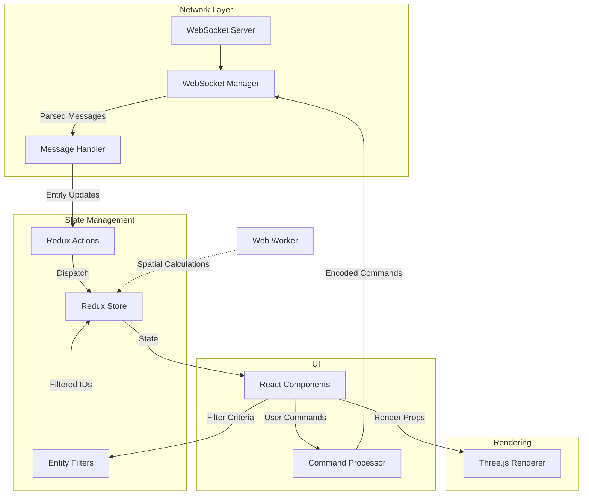
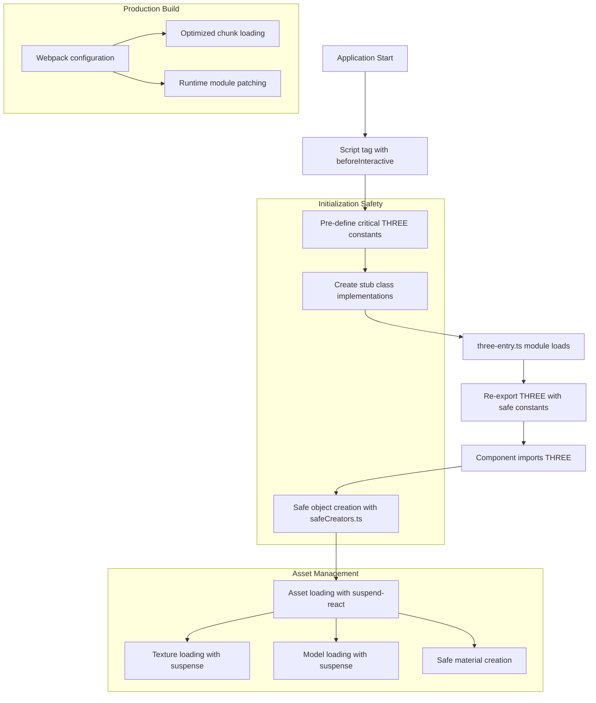

# System Patterns: Real-time Multi-Entity Dashboard

## System Architecture
The dashboard application follows a modern architecture optimized for high-performance real-time visualization:

```
dashboard/
├── app/              # Next.js App Router files
│   ├── api/            # API routes including WebSocket
│   ├── components/     # React components
│   └── utils/          # Utility functions
├── components/       # React components organized by feature
│   ├── visualization/  # 3D visualization components
│   ├── controls/       # UI controls and panels
│   ├── entities/       # Entity-related components
│   └── shared/         # Shared UI components
├── lib/              # Core utilities and logic
│   ├── state/          # Redux state management
│   ├── websocket/      # WebSocket communication
│   ├── three/          # Three.js utilities and helpers
│   │   ├── initialize.ts  # Three.js initialization
│   │   ├── three-entry.ts # Constant pre-initialization
│   │   ├── safeCreators.ts # Safe object creation utilities
│   │   └── suspendedLoader.ts # Suspense-enabled asset loading
│   └── workers/        # Web Worker implementations
└── public/           # Static assets
```

## Key Technical Decisions

### Visualization Architecture
- **Three.js / WebGL**: Core 3D rendering engine
- **React Three Fiber**: React bindings for Three.js
- **WebGL Instancing**: Efficient rendering of similar entities
- **Level of Detail (LOD)**: Dynamic detail based on camera distance
- **Optimized Camera Controls**: Custom controls for smooth navigation

### State Management
- **Redux Toolkit**: Centralized state with normalized entity store
- **Optimized Selectors**: Memoized selectors for efficient state access
- **Immutable State Patterns**: Efficient updates without full re-renders
- **Spatial Indexing**: Optimized data structures for spatial queries

### Real-time Communication
- **WebSockets**: Bidirectional communication for entity updates
- **Connection Management**: Robust connection handling with auto-reconnection
- **Message Queue**: Handling offline scenarios with message queueing
- **Latency Optimization**: Minimizing network overhead for critical updates
- **Ping/Pong Mechanism**: Measuring and monitoring connection latency

### Performance Optimization
- **Web Workers**: Offloading heavy computation from main thread
- **Render Optimization**: Minimizing unnecessary re-renders
- **Memory Management**: Efficient resource allocation and cleanup
- **GPU Acceleration**: Leveraging hardware acceleration for rendering
- **Request Animation Frame**: Synchronized rendering with browser

## Data Flow Architecture



## Component Architecture

### UI Component Hierarchy
```
DashboardLayout
├── ThreeJSVisualization (Main view)
│   ├── CameraControls
│   ├── EntityInstances
│   │   ├── EntityRenderer
│   │   ├── EntityTrajectories
│   │   └── EntityEffects
│   ├── TerrainRenderer
│   └── EffectsManager
├── EntityPanel (Left sidebar)
│   ├── EntityList
│   ├── FilterControls
│   │   ├── TypeFilters
│   │   ├── StatusFilters
│   │   ├── TagFilters
│   │   ├── HealthFilters
│   │   └── SavedFilters
│   └── GroupManager
├── DetailsPanel (Right sidebar)
│   ├── EntityDetails
│   ├── StatusMonitor
│   └── TaskManager
├── CommandBar (Top)
│   ├── QuickCommands
│   └── WaypointTool
└── StatusBar (Bottom)
    ├── ConnectionStatus
    │   ├── StatusIndicator
    │   ├── LatencyDisplay
    │   └── DataSourceToggle
    └── PerformanceMonitor
```

### WebSocket Architecture
```
WebSocketManager
├── ConnectionManager
│   ├── ConnectionState
│   ├── ReconnectionStrategy
│   └── LatencyMonitor
├── MessageHandling
│   ├── MessageQueue
│   ├── MessageProcessors
│   └── MessageTypeHandlers
└── ReactHooks
    └── useWebSocketConnection
```

### Entity Data Model
```typescript
interface Entity {
  id: string;
  type: EntityType;
  position: Vector3;
  rotation: Quaternion;
  velocity: Vector3;
  status: EntityStatus;
  health: {
    batteryLevel: number;
    temperature: number;
    errorCodes: string[];
  };
  tasks: Task[];
  trajectory: {
    pastPositions: Position[];
    projectedPath: Position[];
  };
  tags: string[];
  metadata: Record<string, any>;
  lastUpdated: number;
}
```

### Entity Filter Model
```typescript
interface FilterCriteria {
  id: string;
  name: string;
  description?: string;
  types?: EntityType[];
  statuses?: EntityStatus[];
  tags?: string[];
  healthMin?: number;
  healthMax?: number;
  positionBounds?: {
    x: [number, number] | null;
    y: [number, number] | null;
    z: [number, number] | null;
  };
  customFilter?: string; // JSON string representing a custom function
  isActive: boolean;
  isPinned: boolean;
  dateCreated: number;
  dateModified: number;
}
```

## Design Patterns in Use

### Performance Patterns
- **Object Pooling**: Reusing objects to reduce garbage collection
- **Spatial Partitioning**: Grid or quadtree for efficient entity lookup
- **Dirty Checking**: Only updating changed entities
- **Throttling/Debouncing**: Controlling update frequency
- **Lazy Loading**: Loading assets as needed based on viewport

### UI Patterns
- **Compound Components**: Composable UI components
- **Render Props**: Flexible component composition
- **Container/Presenter**: Separation of data and presentation
- **Context Providers**: Shared state for component trees
- **Portal Components**: Rendering outside normal component hierarchy

### State Management Patterns
- **Normalized Store**: Efficient entity lookup by ID
- **Command Pattern**: Encapsulating operations as commands
- **Middleware Chain**: Processing actions through middleware
- **Selector Pattern**: Memoized data access
- **Saga Pattern**: For complex async operations (if needed)

### Network Communication Patterns
- **Connection Manager**: Centralized WebSocket connection handling
- **Reconnection Strategy**: Exponential backoff for reconnection attempts
- **Message Queue**: Storing messages during connection loss
- **Message Handler Registration**: Observer pattern for message processing
- **Ping/Pong Heartbeat**: Regular heartbeat to verify connection status

### Entity Filtering Patterns
- **Composite Filter**: Building complex filters from simpler ones
- **Filter Registry**: Storing and retrieving saved filters
- **Filter Builder**: Interactive filter construction
- **Filter Persistence**: Saving and loading filter configurations
- **Real-time Filtering**: Applying filters as entity data changes

## WebSocket Implementation

### Connection Management
- **Automatic Reconnection**: Reconnect with exponential backoff
- **Connection States**: Clear progression through connection states
- **Error Handling**: Comprehensive error handling with user feedback
- **Latency Monitoring**: Regular ping/pong for latency measurement
- **Connection Statistics**: Tracking messages, bytes, and connection quality

### Message Processing
- **Message Types**: Standardized message type enumeration
- **Type-based Handlers**: Specialized handlers for each message type
- **Handler Registration**: Dynamic registration of message handlers
- **Message Queue**: Store-and-forward for offline scenarios
- **Message Prioritization**: Critical updates processed before less important ones

### Redux Integration
- **WebSocket Slice**: Dedicated slice for connection state
- **Connection Actions**: Standard actions for connection events
- **Statistics Tracking**: Store for connection statistics
- **Entity Update Actions**: Actions for entity state changes
- **Normalized Updates**: Efficient entity state updates

## Entity Filtering System

### Filter Components
- **Quick Filters**: Simple filters for common operations
- **Saved Filters**: Complex filters that can be saved and reused
- **Filter Builder**: UI for constructing complex filters
- **Filter Visualization**: Visual representation of filter criteria
- **Filter Import/Export**: Sharing filter configurations

### Filter Operations
- **Type Filtering**: Filter by entity type
- **Status Filtering**: Filter by entity status
- **Tag Filtering**: Filter by entity tags
- **Health Filtering**: Filter by health metrics
- **Spatial Filtering**: Filter by position
- **Custom Filtering**: User-defined filter functions

## Performance Considerations
- Maintaining 60+ FPS with 100+ entities
- Supporting 10+ updates per second per entity
- Minimizing memory growth during extended operation
- Efficient spatial queries for large entity sets
- Optimizing render cycles to prevent jank
- Minimizing network latency for command operations 

## Three.js Initialization Architecture



### Three.js Initialization Patterns
- **Pre-initialization Script**: Using Next.js Script with beforeInteractive strategy to define constants and stub implementations
- **Safe Entry Module**: Comprehensive module that defines constants before importing Three.js
- **Safe Object Creation**: Utility functions with try/catch and fallback implementations
- **Asset Loading with Suspense**: Using suspend-react for React Suspense-enabled asset loading
- **Production Build Optimization**: Specialized Webpack configuration for proper Three.js initialization in production 