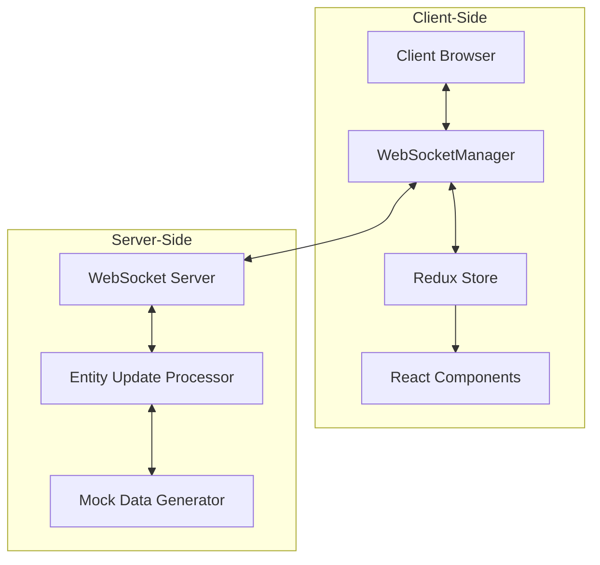

# Tech Context: Real-time Multi-Entity Dashboard

## Core Technologies

### Frontend Framework
- **Next.js 15.3.1**: React framework providing:
  - App Router for routing and organization
  - Optimized client-side rendering
  - Build optimization for performance
  - Development tools and hot reloading

### UI Library
- **React 19**: Latest React version with:
  - Improved rendering performance
  - Enhanced component lifecycle
  - Concurrent rendering capabilities
  - Improved hooks system

### Visualization Technologies
- **Three.js**: WebGL-based 3D library for:
  - Entity rendering in 3D space
  - Camera controls and navigation
  - WebGL acceleration and optimization
  - Shader programming and effects
  - Initialized with enhanced compatibility approach

- **React Three Fiber**: React bindings for Three.js:
  - Declarative Three.js scene creation
  - React component-based 3D objects
  - Integration with React component lifecycle
  - Performance optimizations for React + Three.js

- **Three.js Initialization Strategies**:
  - Enhanced pre-initialization with Script tag (beforeInteractive)
  - Comprehensive stub implementations for core Three.js objects
  - Safe creation utilities for Three.js objects
  - Custom entry module with constant pre-definition
  - Optimized webpack configuration for proper bundling

- **Asset Management**:
  - suspend-react for React Suspense-enabled asset loading
  - Optimized texture loading with error handling
  - Safe fallbacks for creation failures
  - Proper caching with memo and suspense
  - Memory-efficient model loading

### State Management
- **Redux Toolkit**: State management with:
  - Normalized entity store
  - Efficient state updates
  - Middleware for side effects
  - DevTools for debugging

### Real-time Communication
- **WebSockets**: For real-time data:
  - Bidirectional communication
  - Low-latency updates
  - Auto-reconnection handling
  - Binary data support

- **Socket.IO**: WebSocket library with enhanced capabilities:
  - Automatic fallback to HTTP long-polling
  - Built-in reconnection logic
  - Room-based messaging (for entity groups)
  - Middleware support for authentication
  - Connection state management

- **WebSocket Server-Side Implementation**:
  - Next.js API routes with ws package
  - Custom WebSocket upgrade handling
  - Message type standardization
  - Mock data generation for testing
  - Command processing interface

- **WebSocket Client Architecture**:
  - WebSocketManager class for connection handling
  - Reconnection with exponential backoff
  - Message queue for offline scenarios
  - Typed message handlers
  - Ping/pong for latency monitoring
  - React hooks for component integration

### Performance Optimization
- **Web Workers**: For background processing:
  - Offloading heavy computation
  - Parallel data processing
  - Freeing main thread for UI

- **WebGL Instancing**: For efficient rendering:
  - Rendering similar objects efficiently
  - Reducing draw calls
  - Optimizing GPU usage

## Development Tools

### Language
- **TypeScript 5**: Static typing for JavaScript:
  - Strong type definitions
  - Enhanced developer tooling
  - Better code documentation and intellisense
  - Improved refactorability

### Development Environment
- **Vite**: Modern build tooling:
  - Fast HMR (Hot Module Replacement)
  - ESM-native development
  - Optimized production builds
  - Plugin ecosystem

- **ESLint 9**: Code linting with Next.js config
- **Jest/Testing Library**: Unit and component testing
- **Cypress**: End-to-end testing

## Technical Constraints

### Performance Requirements
- Must maintain 60fps minimum for up to 100 entities
- UI must remain responsive during high-frequency updates
- Visualization must render smoothly on mid-range hardware
- Memory usage must remain reasonable for long sessions
- WebSocket reconnection must be fast and reliable

### Browser Requirements
- Primary support: Chrome, Edge, Firefox (latest 2 versions)
- Secondary support: Safari (latest version)
- WebGL 2.0 support required
- WebSocket support required
- No IE11 support required

### Network Requirements
- Minimum 1Mbps connection for real-time updates
- Must handle intermittent connectivity gracefully
- Reconnection strategy required for connection drops
- Latency display for connection quality awareness
- Message queueing for offline scenarios

### Compatibility Issues
- Three.js version 0.176.0 has breaking changes from earlier versions
- Some dependencies like Troika require older Three.js constants that were removed
- Need compatibility patches for constants like LinearEncoding (3000), sRGBEncoding (3001)
- Potential hydration issues due to Next.js SSR with client-only Three.js components
- Several compatibility patch files have been removed and consolidated into a single approach

## Development Setup

### Local Environment
```bash
# Install dependencies
npm install

# Start development server
npm run dev

# Build for production
npm run build

# Start production server
npm run start

# Run unit tests
npm run test

# Run E2E tests
npm run cypress
```

### Required Tools
- Node.js 20.x or higher
- npm 10.x or higher
- Git for version control
- Modern browser with WebGL support

## Dependencies Overview

### Core Production Dependencies
- `next`: 15.3.1
- `react`: 19.0.0
- `react-dom`: 19.0.0
- `three`: Latest version
- `@react-three/fiber`: React bindings for Three.js
- `@react-three/drei`: Useful helpers for React Three Fiber
- `@reduxjs/toolkit`: State management
- `react-redux`: React bindings for Redux
- `socket.io-client`: WebSocket client with enhanced features
- `ws`: WebSocket server implementation for Node.js API routes
- `@types/ws`: TypeScript types for ws package

### Development Dependencies
- `typescript`: 5.x
- `eslint`: 9.x
- `vite`: For fast builds
- `jest`: Unit testing
- `@testing-library/react`: Component testing
- `cypress`: E2E testing
- `@types/three`: TypeScript types for Three.js 

## WebSocket Implementation

### Connection Architecture


### Reconnection Strategy
The WebSocket implementation uses an exponential backoff strategy for reconnection:

```typescript
// Reconnection with exponential backoff
private attemptReconnection(): void {
  if (this.reconnectAttempts >= this.config.maxReconnectAttempts) {
    // Max attempts reached, notify application
    return;
  }
  
  this.reconnectAttempts++;
  this.updateConnectionState(ConnectionState.RECONNECTING);
  
  // Calculate delay with exponential backoff
  const delay = this.config.reconnectInterval * Math.min(this.reconnectAttempts, 5);
  
  // Schedule reconnection attempt
  this.reconnectTimer = setTimeout(() => {
    this.connect().catch(() => {
      // Connection failed, will try again automatically
    });
  }, delay);
}
```

### WebSocket Message Types
```typescript
// Standardized WebSocket message types
export enum MessageType {
  ENTITY_UPDATE = 'entityUpdate',
  ENTITY_BATCH_UPDATE = 'entityBatchUpdate',
  ENTITY_DELETE = 'entityDelete',
  CONNECTION_STATUS = 'connectionStatus',
  AUTHENTICATION = 'authentication',
  COMMAND = 'command',
  COMMAND_RESPONSE = 'commandResponse',
  ERROR = 'error'
}
```

### WebSocket Message Structure
```typescript
// Standard WebSocket message interface
export interface WebSocketMessage {
  type: MessageType;
  payload: any;
  timestamp?: number;
  messageId?: string;
}
```

### Message Handling
```typescript
// Message handler registration system
registerMessageHandler(type: MessageType, handler: (message: WebSocketMessage) => void): void {
  if (!this.messageHandlers.has(type)) {
    this.messageHandlers.set(type, []);
  }
  
  this.messageHandlers.get(type)!.push(handler);
}

// Message processing
private processMessage(message: WebSocketMessage): void {
  // Process based on message type
  switch (message.type) {
    case MessageType.ENTITY_UPDATE:
      // Handle entity update
      break;
    case MessageType.ENTITY_BATCH_UPDATE:
      // Handle batch update
      break;
    // ...other message types
  }
  
  // Notify registered handlers
  this.notifyMessageHandlers(message);
}
```

### Latency Monitoring
The WebSocket implementation uses a ping/pong mechanism to measure connection latency:

```typescript
// Ping function for latency measurement
const ping = useCallback(async () => {
  if (connectionState !== ConnectionState.CONNECTED) {
    return;
  }
  
  // Record start time
  const startTime = Date.now();
  
  // Wait for pong response
  const pongPromise = new Promise<number>((resolve) => {
    const handlePong = (message: any) => {
      if (message.type === 'pong') {
        // Calculate latency
        const latency = Date.now() - startTime;
        resolve(latency);
      }
    };
    
    // Register handler and set timeout
    // ...
  });
  
  // Send ping message
  websocketManager.sendMessage({
    type: MessageType.CONNECTION_STATUS,
    payload: {
      type: 'ping',
      timestamp: Date.now()
    }
  });
  
  // Update latency in Redux store
  const latency = await pongPromise;
  
  if (latency > 0) {
    dispatch({
      type: 'websocket/connectionStatusUpdate',
      payload: { latency }
    });
  }
}, [connectionState, dispatch]);
```

## Entity Filtering Implementation

### Filter Criteria Structure
```typescript
// Comprehensive filter criteria interface
export interface FilterCriteria {
  id: string;
  name: string;
  description?: string;
  types?: EntityType[];
  statuses?: EntityStatus[];
  tags?: string[];
  healthMin?: number;
  healthMax?: number;
  positionBounds?: {
    x: [number, number] | null;
    y: [number, number] | null;
    z: [number, number] | null;
  };
  customFilter?: string;
  isActive: boolean;
  isPinned: boolean;
  dateCreated: number;
  dateModified: number;
}
```

### Filter State Management
```typescript
// Entity filter state
interface EntityFilterState {
  activeFilterId: string | null;
  savedFilters: Record<string, FilterCriteria>;
  quickFilters: {
    types: EntityType[];
    statuses: EntityStatus[];
    tags: string[];
    healthThreshold: number | null;
  };
  filteredIds: string[];
  highlightedIds: string[];
  hiddenIds: string[];
  showingFiltered: boolean;
  showHidden: boolean;
}
```

## Deployment Considerations

### Vercel Deployment
The application is deployed on Vercel with the following configuration:
- Output directory: `.next`
- Node.js version: 20.x
- Environment variables configured for production
- WebSocket API route using Node.js runtime (not Edge runtime)

### Environment Variables
- `NEXT_PUBLIC_API_URL`: API endpoint URL
- `NEXT_PUBLIC_WS_URL`: WebSocket endpoint URL
- `NEXT_PUBLIC_MOCK_DATA`: Enable mock data in production (true/false)

### WebSocket Server Configuration
For WebSocket server, the application requires:
- Node.js runtime for WebSocket support
- Configuration of ws package for server-side WebSocket
- Proper request handling for WebSocket upgrade
- Correct CORS configuration for WebSocket connections

```typescript
// Configuration for WebSocket API route
export const config = {
  runtime: 'nodejs'
};
```

### Scaling Considerations
- WebSocket connections are scaled horizontally
- Static assets are cached at the edge
- API requests use serverless functions with auto-scaling

## Technical Debt and Limitations

### Known Issues
- Limited browser compatibility with older browsers
- Performance degradation with >500 entities
- Mobile device performance varies significantly
- WebSocket implementation requires Node.js runtime

### Future Improvements
- WebGL 2.0 optimizations for performance
- WebAssembly for computation-intensive tasks
- OffscreenCanvas for improved worker thread rendering
- GPU-based particle systems for large entity counts
- Protocol Buffers for efficient message serialization 